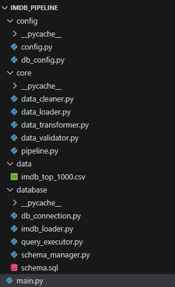

# IMDb Data Analysis Pipeline

## Overview
This project implements a **fully automated data pipeline** for the IMDb Movies & TV Shows dataset using **Python (Pandas)** and **PostgreSQL**. It follows **OOP principles** and modular design so that it can be reused for other datasets with minimal changes.  

The pipeline covers:

1. Data cleaning and preparation (Pandas)
2. Star schema design (Data Warehouse style)
3. PostgreSQL table creation
4. ETL load of cleaned data
5. 15+ analytical SQL queries executed from Python
6. Logging, progress bars, and result export to CSV

---

## 🗂️ Project Structure

---

## 🔧 Features

- **Step 1: Data Cleaning**
  - Handles missing values, duplicates, string trimming
  - Converts numeric/date columns automatically
  - OOP & reusable

- **Step 2: Star Schema Design**
  - `movies`, `directors`, `actors`, `genres`
  - Many-to-many relationships handled via junction tables
  - Data warehouse style

- **Step 3: PostgreSQL Tables**
  - Fully created from Python
  - No manual DB panel required

- **Step 4: ETL Load**
  - Loader class inserts data
  - Handles many-to-many inserts for actors, directors, genres
  - Reusable for different datasets

- **Step 5: Analytical Queries**
  - 15+ queries for ratings, votes, runtime, genre, top actors/directors
  - Progress bar with `tqdm`
  - Logs executed queries
  - Top 5 rows preview in console
  - Saves results to CSV

- **Additional**
  - Insert/Update/Delete queries supported
  - Fully modular and OOP

---
